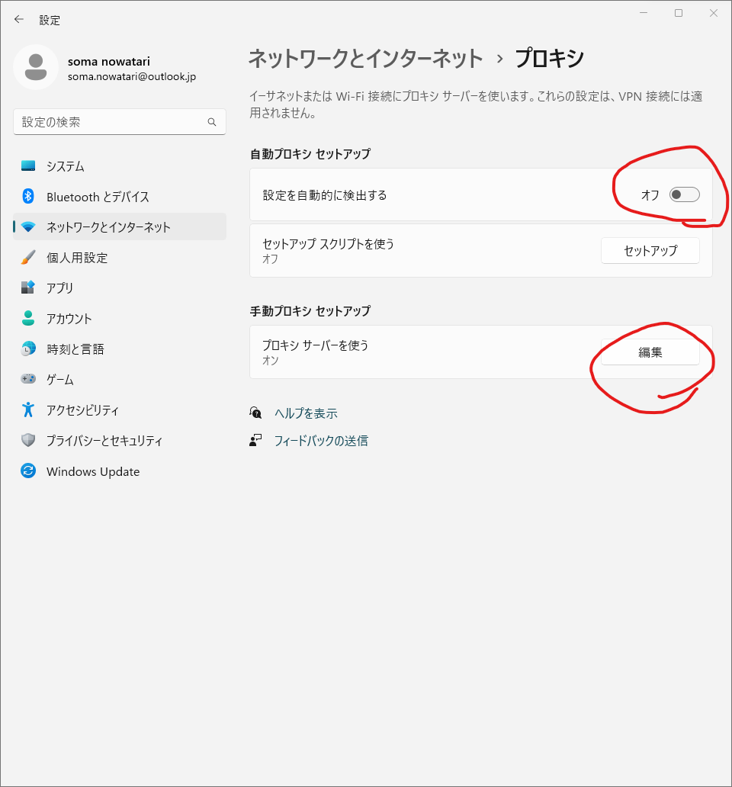
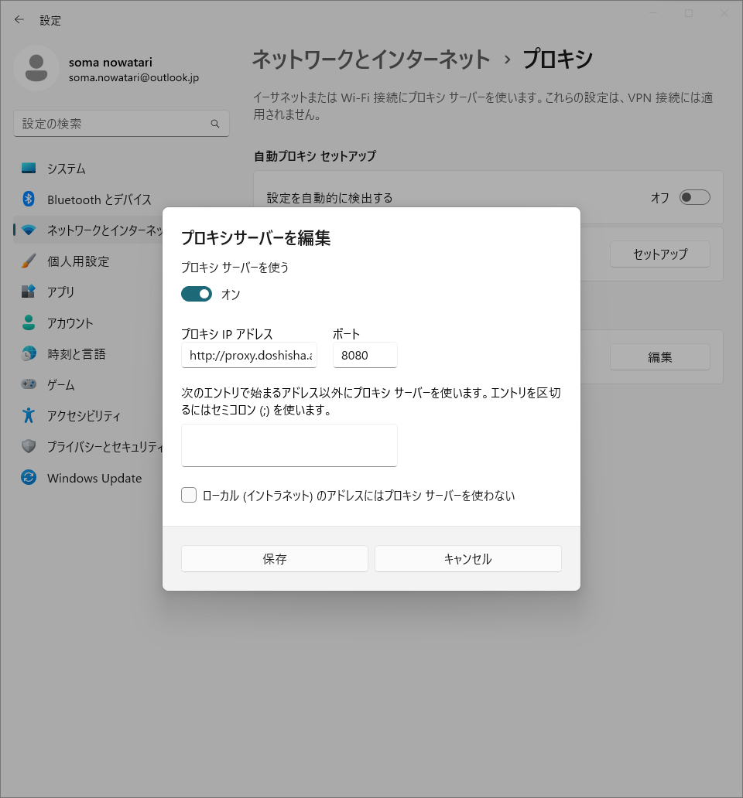

設定 > ネットワークとインターネット > プロキシ に移動する．

- 自動プロキシセットアップの床の，設定を自動的に検出するを**オフ**にする．
- 手動プロキシセットアップ > プロキシサーバーを使うの編集ボタンをクリックし，プロキシサーバを使うを**オン**に，プロキシIPアドレスに
    ```
    http://proxy.doshisha.ac.jp
    ```
    ポートに
    ```
    8080
    ```
    を入れる．
    
そして下部にある保存を押して完了．
